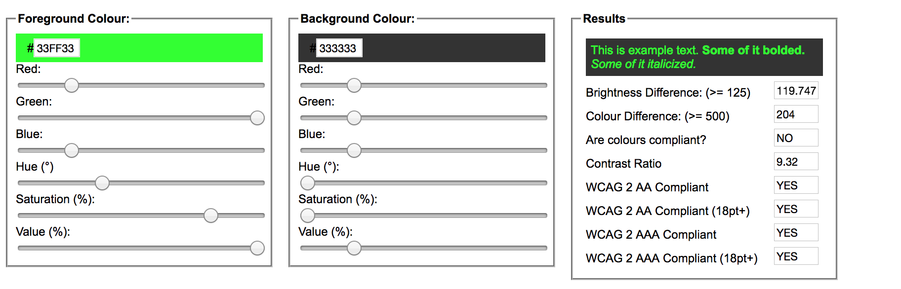
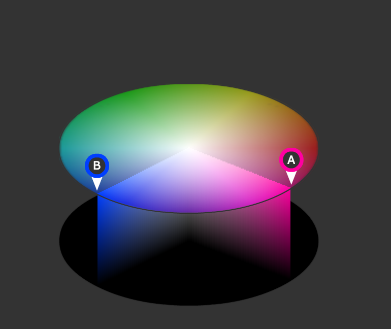
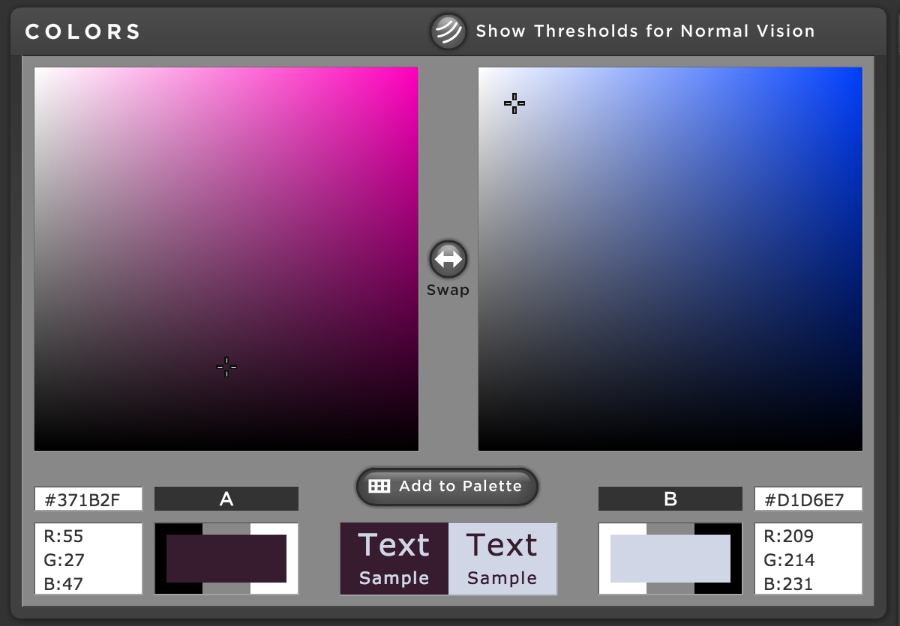
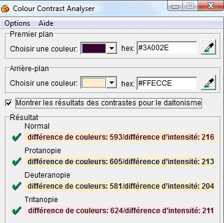

Ecrire un HTML accessible
-------

L'accessibilité réside dans la capacité d'un medium (dans notre cas un site internet) à être lisible dans un maximum de situations, pour un maximum de personnes.

Le terme anglais "accessibility" étant relativement long, il est parfois abrégé en **a11y** (le 11 représentant les 11 caractères tronqués).

> l'a11y DOIT faire partie du processus de design, on doit l'enseigner comme ça, non plus se contenter de "sensibiliser" :) d'où l'importance de convaincre une corporation maintenant que c'est une part intégrante de la discipline ! - [Marie-Cécile Paccard ](https://twitter.com/mcpaccard/status/891916591407005696)

Parmi les critères à prendre en compte:

- Le contraste de couleur est-il suffisant?
- Les images ont-elles un texte descriptif (balise alt)?

## Contraste couleur

Les contrastes de textes sont élémentaires en terme d’accessibilité de site internet. Les choix typographiques ainsi que les couleurs sont à faire méticuleusement afin que toute personnes souffrantes de troubles de la vue permanent ou temporairepuissent voir. Le premier terme désigne certaines déficiences visuelles, le second la fatigue oculaire dûe aux heures passées derrière un écran de mauvaise qualité par exemple. A ne pas oublier qu'avec l'âge les problèmes de vue s'accentuent. Il n'y pas que ça comme soucis de vue, par exemple la dysléxie (8 à 12 % de la population mondiale en souffrirait), le daltonisme (8% de cas chez les hommes et 0,5% du côté des femmes) 

Le texte est sûrement une des parties la plus importantes pour un site. Il sert à la compréhension même de celui-ci. Voilà pourquoi un bon traitement entre contrastes et couleurs est primordial pour ne pas avoir à plisser les yeux derrière son écran. Cepandant ce point essentiel est souvent fait de manière rapide et baclée.

Le WCAG "Web Content Accessibility Guidelines" ou "Règles pour l'accessibilité des contenus Web". Mais qu'est-ce que c'est le WCAG?

C'est des recommandations internationales édités par la WAI (Initiative sur l’Accessibilité du web). Il existe deux version, la WCAg1.0 (1999) et WCAG2.0 (dès 2008). Ce qui différencie ces deux versions c'est le ciblage technologique: WCAG1.0 s'occupait plus certaines technologies ainsi que le contenu HTML et les transformations. Alors que WCAG2.0 cherche à s’en extraire pour devenir abscon et universel.

Il existe trois niveaux de recommandations:

* **Niveau A :** niveau fondamental satisfaisant tous les critères d’accessibilité de priorité 1. Le site offre un accès minimal aux informations contenues dans les documents Web.
* **Niveau AA :** niveau satisfaisant tous les critères d’accessibilité de priorité 1 et 2. Le site offre un accès « correct » aux informations contenues dans les documents Web.
* **Niveau AAA :** niveau satisfaisant tous les critères d’accessibilité de priorité 1, 2 et 3. Le site offre un accès excellent aux informations contenues dans les documents Web.

Les recommandations de contrastes notés ici sont utiles seulement pour une lecture sur écran.

D'après les recommandations WCAG 2.0 du W3C (Le World Wide Web Consortium, est un organisme de normalisation {maintien de normes} à but non lucratif. Il à été fondé en octobre 1994 et est dirigé par l'inventeur du Web, Tim Berners-Lee. Il s'occupe de la compatibilité des technologies du World Wide Web telles que HTML,CSS), pour obtenir le niveau AA, la règle 1.4.3 indique ceci :

> "Le texte (ou les images de texte informatif) de moins de 18 points (ou moins de 14 points en gras) devrait posséder un contraste de luminosité d’au moins 4,5 pour 1 avec son arrière-plan.
> Le texte (ou les images de texte informatif) de plus de 18 points (ou plus de 14 points en gras) devrait posséder un contraste de luminosité d’au moins 3 pour 1 avec son arrière-plan."

Pour obtenir le niveau le plus haut, AAA, la règle 1.4.6 indique :

> "Le texte (ou les images de texte informatif) de moins de 18 points (ou moins de 14 points en gras) devrait posséder un contraste de luminosité d’au moins 7 pour 1 avec son arrière-plan.
> Le texte (ou les images de texte informatif) de plus de 18 points (ou plus de 14 points en gras) devrait posséder un contraste de luminosité d’au moins 4,5 pour 1 avec son arrière-plan. »

(https://www.w3.org/TR/2008/REC-WCAG20-20081211/#contrast-ratiodef) ici une catégorie qui nous montre les formules mathématiques pour calculer les contrastes.

Luminosité et différence de tonalité
===

Le calcul de contraste c’est une chose, et pour aller plus loin dans la perfection d’un site (ou autre) d’autres indicateurs sont intéressants tel que la luminosité et la différence de tonalité. Les formules pour les calculer sont très complexes et demanderais une rédaction nettement plus longue pour voir en détail leurs fonctions. 

Toutefois on sait qu’il faut, du moins il est recommandé, d’avoir une luminosité supérieure ou égale à 125 ainsi qu’une différence de tonalité supérieure ou égale à 500 pour garantir une bonne lisibilité.

Evidemment devoir faire à chaque fois des longs calculs pour la couleur du texte puis celle du fond devient très fatiguant. C’est pourquoi des applications ont été mises au point pour nous faciliter ce problème. Elles nous permettent d’obtenir vite les informations que l’on veut.

En voici 4 pour étudier les contrastes de textes:

* **Color contrast check**  

C’est un outil de vérification de contraste de couleur. Très pratique est simple à comprendre, il affiche les valeurs de contrastes et les différences de tonalité. Cela nous permet ainsi de voir si ces dernières sont adéquates aux recommandations du WCAG. Il nous indique aussi la luminosité à avoir. 

On peut également changer en temps réel les couleurs pour voir leur impact en direct, on gagne ainsi du temps en pouvant s’adapter rapidement. 

* **Contrast-A**

Quant à elle, cette application permet de faire des combinaisons de couleurs et de créer des palettes de couleurs personnalisées. Parmi ses autres utilitaires l’application donne la possibilité de voir nos choix de combinaisons avec certains handicaps visuels comme par exemples certaines formes de daltonisme (la protanopie, la deutéranopie et la tritanopie) ou bien avec une déficience totale de vision des couleurs (color blindness en anglais). De plus ces handicaps sont annotés selon les choix des couleurs. Et pour finir les contrastes, la luminosité et les différences de tonalité sont tous calculés.

* **Color contrast analyser** 

Ce logiciel est disponible sous Windows et Macintosh. Il est utile pour calculer la luminosité, la différence de tonalité pour différents types de daltonisme. C’est un site complet et simple à utiliser 

* **Extensions Firefox**

C’est une extension pour Firefox. Elle permet d’évaluer très vite les contrastes de textes et de savoir si ils sont conformes aux recommandations WCAG 2.0.

Il existe également d’autres outils pour les logiciels de graphisme, comme pour Photoshop par exemple qui, depuis la version CS4, à des filtres pour le daltonisme. Pour les trouver il suffit d’aller sous *Affichage > Format d’épreuve > Dyschromatopsie (protanopie et deutéranopie)*. Sinon il existe aussi des plugins proposé par VisCheck. Gimp à aussi son lot d’outils pour les problèmes de vision, tout comme Inskape qui a aussi des extensions pour ces mêmes problèmes. 

En ayant vu toutes ces possibilités il ne faut pas oublier que la lisibilité d’un site se résume pas qu’aux contrastes mais également: le choix de la police (avec ou sans sérif, la forme et l’épaisseur des caractères), le style appliqué (gras, italique, lettres capitales), les interlignages entre les lignes et les caractères, la longueur du texte, etc. 

Un dernier pointage sur les contrastes. Contraste positif ou négatif ?

Certaines recherches ont démontrés que le texte à contraste positif (texte foncé sur fond clair) est beaucoup plus lisible que celui à contraste négatif texte clair sur fond sombre). Le fond sombre pose des problèmes tels que des reflets comme celui du soleil par exemple ou bien un soucis au niveau de la batterie car un écran trop lumineux consomme plus de batterie. 

Cependant des contrastes trop fort, même positifs sont agressifs pour la vue et accentue la fatigue oculaire. Pour exemple prenons le noir pur #000 sur un fond blanc pur aussi #fff. Cette combinaison gêne les dyslexiques car le contraste trop grand aura tendance à faire « bouger » le texte. On appel ce phénomène « syndrome d’Irlen » et ne concerne pas uniquement les personnes souffrantes de dyslexie. 

Avec cette même combinaison un effet de halo peut se produire lors de la lecture pour les personnes âgées et/ou sensibles à la lumière. Pour améliorer ces contrastes un gris très léger au lieu du blanc pour le fond et éclaircir le noir du texte fera l’affaire. 

En conclusion la clef de la réussite pour une bonne lisibilité c’est l’équilibre! Un bon contraste est essentiel et important. Plusieurs outils sont à notre disposition pour nous aider à trouver cet équilibre.  Ces outils sont également utiles, non pas seulement pour des personnes ayant un handicap, mais aussi pour celles ayant une vue «  normale ». Ils permettent un confort de lecture plus conséquent.

- *[Contrastes de texte](http://openweb.eu.org/articles/accessibilite_contrastes_textes_sites)*, un article par  Nicolas Hoffmann, sur openweb.eu.org
- Un outil pour tester les couleurs du texte et du fond: [http://jxnblk.com/colorable/demos/text/](http://jxnblk.com/colorable/demos/text/)
- Un autre outil: [http://leaverou.github.io/contrast-ratio/#%23222-on-%23fff](http://leaverou.github.io/contrast-ratio/#%23222-on-%23fff)

Taille du texte
===

La taille par défaut des navigateurs est **16px**, ce qui correspond à environ 11pts sur un document imprimé.

Lire: 

- *[Stop Arial 11px](http://romy.tetue.net/stop-arial-11px?lang=fr)*, par Romy Têtue, 2011.
- *[Améliorer la lisibilité typographique](http://romy.tetue.net/ameliorer-lisibilite-typographique?lang=fr)*, par Romy Têtue, 2013.
- [The 100% Easy-2-Read Standard](https://ia.net/know-how/100e2r), par Oliver Reichenstein, 2006.
- [Web Design is 95% Typography](https://ia.net/know-how/the-web-is-all-about-typography-period), par Oliver Reichenstein, 2006.

TODO: information sur les critères, WCAG 1.0, WCAG 2.0, Section 508, RGAA, ARIA...

Web Content Accessibility Guidelines (WCAG) 2.0
===

Le texte entier: [https://www.w3.org/TR/WCAG20/](https://www.w3.org/TR/WCAG20/)

À propos du texte alternatif:

[Bien utiliser le texte alternatif](http://www.pompage.net/traduction/Bien-utiliser-le-texte-alternatif), par WebAIM, 2007

Ressources
===

En français:

* [Convaincre les designers des bienfaits de l’accessibilité, oui, mais comment ?](https://marieguillaumet.com/convaincre-les-designers-des-bienfaits-de-l-accessibilite/) par Marie Guillaumet, juillet 2017

En anglais:

* [Teach Access](https://teachaccess.github.io/tutorial/) "this tutorial will provide basic training for developers and designers interested in building inclusive experiences."
* [Tools for Developing Accessible Websites](https://bitsofco.de/tools-for-developing-accessible-websites/) par Ire Aderinokun, novembre 2016
* [Rules for Using ARIA in HTML](https://bitsofco.de/rules-for-using-aria-in-html/) par Ire Aderinokun, janvier 2017
* [Web accessibility myths 2011](http://www.hassellinclusion.com/2011/12/accessibility-myths-2011/) Jonathan Hassell, 2011
* [Web Accessibility Myths 2011 part 2](http://www.hassellinclusion.com/2012/01/web-accessibility-myths-2011-part2/) Jonathan Hassell, 2012
