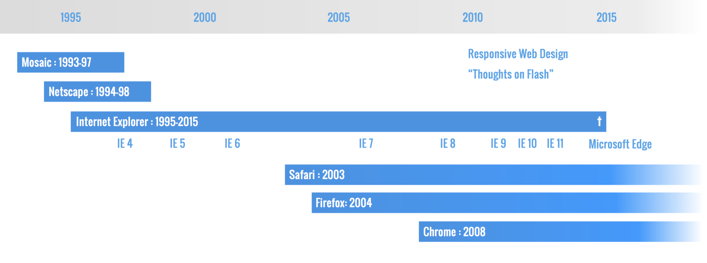
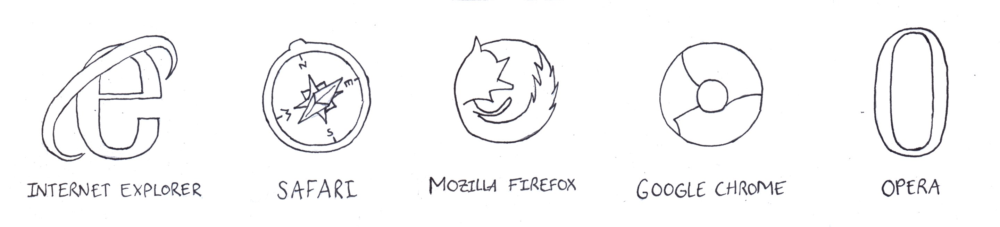

## Les navigateurs en usage

Depuis les débuts du web, les capacités des navigateurs ont fortement évolué. Lors du développement d'un projet web, il est important de considérer quels sont les navigateurs en usage (qui peuvent varier selon la zone géographique, et même selon le public d'un site donné). 

    
*L'évolution des navigateurs entre 1995 et 2015*

Certains choix qui auraient été exclus en 2014 sont devenus pertinents en 2016 (p.ex. l'usage de [Flexbox](/css/layout#une-nouvelle-approche-flexbox) pour la création de mises en page CSS).

Les navigateurs actuellement en utilisation (usage mondial, août 2021, toutes plateformes):

1. **Chrome**: 65% (dont 34% sur Android)
2. **Safari**: 18% (dont 12% iPhone)
3. **Firefox**: 3.77%
4. **Samsung Internet**: 3.33%
5. **Edge**: 3%

Les statistiques pour la Suisse en août 2021 (fournies par [gs.statcounter.com](https://gs.statcounter.com/browser-market-share/all/switzerland/#monthly-202007-202107-bar)):

1. **Chrome**: 41.57%
2. **Safari**: 33.71%
3. **Firefox**: 8.73%%
4. **Edge**: 6.89%
5. **Samsung Internet**: 3.33%

## Navigateurs courants

**Chrome** est un navigateur développé par Google depuis 2008. C'est le navigateur le plus utilisé en 2021, aussi bien en trafic *desktop* que mobile.

**Safari** est un navigateur développé par Apple depuis 2003.

**Firefox** est un navigateur open-source développé par la fondation Mozilla depuis 2003.

**Edge** est un navigateur développé par Microsoft. Sorti en 2015, il est inclus dans le système Windows 10. Son usage global en 2021 est de 3% seulement.

**Samsung Internet** est un navigateur web mobile pour les smartphones et les tablettes Android développé par Samsung depuis 2015. Il est basé sur le projet open-source Chromium.