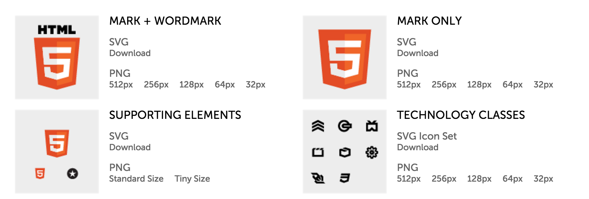

## Les versions du langage HTML.

Durant ses plus de 30 années d'existance, le standard HTML a connu diverses évolutions. La [première version](https://www.w3.org/History/19921103-hypertext/hypertext/WWW/MarkUp/Tags.html) proposée en 1991 comportait 18 éléments. Différentes versions du standard HTML sont publiées, jusqu'à la version **HTML 4.01** en 1999.

S'ensuit une période de stagnation, durant laquelle le groupe de travail HTML du World Wide Web Consortium (W3C) focalise ses efforts sur un nouveau langage, le **XHTML**, qui s'avère une impasse.

En 2004, un groupe de travail concurrent se forme, nommé **WHATWG** (Web Hypertext Application Technology Working Group), rassemblant des représentants de Apple, Mozilla et Opera. Ce groupe élabore le standard **HTML5** entre 2004-2007. En janvier 2008, la première spécification est publiée, qui est adoptée comme référence par le groupe de travail HTML du W3C.

## HTML5

Dès 2010, les premiers éléments du HTML5 ont commencé à être supportés par les navigateurs, et des livres sur le HTML commencent à être publiés. Un [logo officiel](https://www.w3.org/html/logo/), conçu par l'agence hawaïenne [Ocupop](http://ocupop.com/html5), est dévoilé en janvier 2011.

Ce n'est qu'en 2014 que le HTML5 devient une recommandation stable du W3C.

En fin 2016, le W3C rend officielle la version HTML 5.1. En décembre 2017, c'est la [version 5.2](https://www.w3.org/TR/html52/) qui est officialisée. La version actuellement en travail est la 5.3.

Pendant quelques années, la spécification HTML est maintenue de manière parallèle par les deux groupes de travail, **W3C** et **WHATWG**.

Depuis 2019, un accord est signé, et on trouve la spécification HTML à un endroit : [https://html.spec.whatwg.org/](html.spec.whatwg.org/multipage/)

**Références:**

- *[HTML5 et l’avenir du web](http://www.pompage.net/traduction/html5-et-le-futur-du-web)*, par Tim Wright, 2009
- *[The design of HTML5](https://adactio.com/articles/1704)*, présentation de Jeremy Keith, donnée à la conférence Fronteers 2010, Amsterdam.
- Un outil pour vérifer le support de votre navigateur: [http://html5test.com/](http://html5test.com/)
